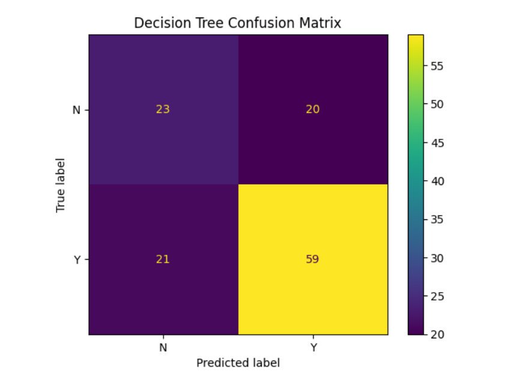
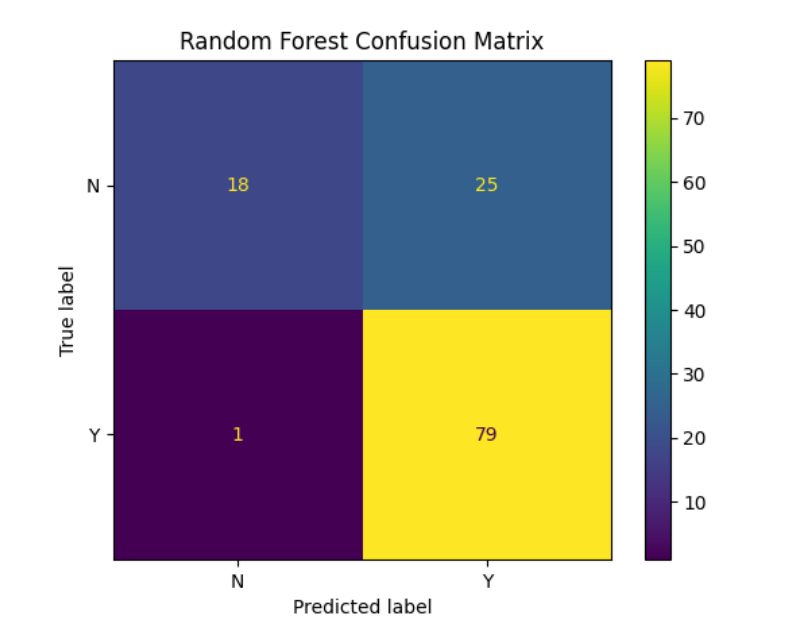

# Loan-Eligibility-Prediction
### **Loan Eligibility Prediction**

This repository contains an end-to-end machine learning project to automate the loan eligibility process for a housing finance company. By building and evaluating predictive models, the project provides a data-driven solution to streamline loan approvals and improve operational efficiency.

#### **🚀 Executive Summary**

**The Challenge:** Dream Housing Finance wants to automate its manual loan approval process and make faster, more accurate decisions. The goal is to build a machine learning model that can predict a customer's loan eligibility based on key financial and demographic data.

**The Solution:** This project develops a complete machine learning pipeline, from data preprocessing to model deployment. We compare the performance of a **Decision Tree Classifier** and a **Random Forest Classifier** to identify the most effective model for this business problem.

#### **📊 Dataset & Features**

* **Source:** A publicly available dataset from Kaggle.
* **Features:** Gender, Marital Status, Education, Dependents, Income, Loan Amount, Credit History, and others.
* **Target Variable:** `Loan_Status` (Y for approved, N for not approved).

#### **⚙️ Methodology & Workflow**

1.  **Exploratory Data Analysis (EDA):** Initial data inspection, including identifying and handling missing values.
2.  **Data Preprocessing:** Imputing missing data, creating new features like `TotalIncome`, and encoding categorical variables.
3.  **Model Building & Evaluation:**
    * **Decision Tree:** A baseline model to establish performance metrics.
    * **Random Forest:** An ensemble model optimized using **GridSearchCV** to improve accuracy and generalization.
4.  **Performance Analysis:** Models are evaluated using a comprehensive classification report and a confusion matrix.

#### **📈 Key Findings**

The **Random Forest Classifier** was selected as the final model due to its superior performance and ability to generalize well to unseen data. Its robustness and high accuracy make it ideal for deployment in a real-time application system.

*See the full Jupyter notebook for detailed analysis, visualizations, and a breakdown of the results.*

#### 🖼️ Sample Visuals
Here are some plots from the analysis:

  


[🔗 View full notebook](Loan_Eligibility_Prediction.ipynb)


#### **🚀 Next Steps**

* **Deployment:** The trained Random Forest model is ready to be deployed as a microservice using frameworks like Flask or Streamlit.
* **Further Analysis:** Explore additional feature engineering or experiment with other ensemble methods.

#### **🛠️ Installation**

## 🛠️ Installation

To run the notebook locally, clone this repository and install the required libraries:

```bash
git clone https://github.com/Elsie-Muhumuza/Loan-Eligibility-Prediction-Model.git
cd Loan-Eligibility-Prediction-Model
pip install -r requirements.txt


